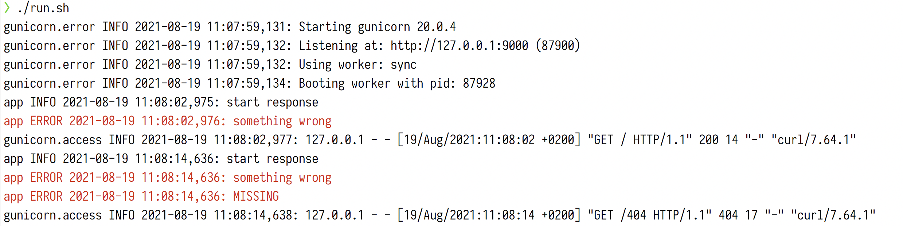

# Gunicorn with sensible logging

The problem with Gunicorn's logging (mentioned in
[this thread](https://github.com/benoitc/gunicorn/issues/2453)) that I've seen
many people have is that it sends normal events to stderr.

This repo shows how you can configure Gunicorn to have sensible logging: normal
events should go to stdout and errors to stderr.

## Running

Just run `./run.sh` to run a Gunicorn server, then you can
`curl http://localhost:9000` for a normal response and
`curl http://localhost:9000/404` for a 404 response.

## Implementation

First off, this creates a bash function `color` in `run.sh` so that we can
clearly see which lines are stdout and which are stderr. This is how the output
looks like after requesting a normal and a 404 response:

The Python logging is configured in gunicorn.py and then referenced when running
Gunicorn.
